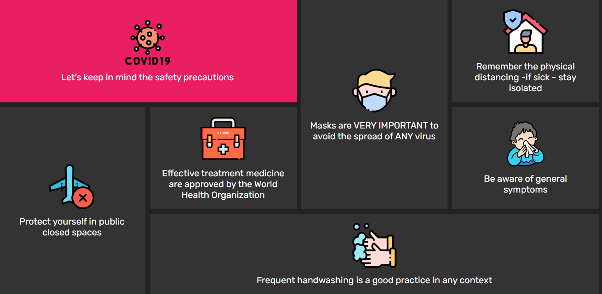

# CSSgrid
>Learning more about CSS grid
 
Deployment ˚ ༘✶ ⋆｡˚ ⁀➷[_here_](https://rhanateix.github.io/CSSgrid/)

## Table of Contents
* [General Info](#general-information)
* [Technologies Used](#technologies-used)
* [Notes](#notes)
* [Screenshots](#screenshots)
* [Project Status](#project-status)
* [Room for Improvement](#room-for-improvement)
* [Acknowledgements](#acknowledgements)
* [Contact](#contact)

»»————-　★　————-««»»————-　★　————-««»»————-　★　————-««»»————-　★　

## General Information

- What problem does it (intend to) solve? Different styles
- What is the purpose of your project? Learn more about CSS grid
- Why did you undertake it? I want to improve my skills and learn more about the style used in the project

## Technologies Used
- HTML5
- CSS3

## Notes
  
  ˚ ༘✶ ⋆｡˚ ⁀➷ This project was made by and with the purpose of learning 
    
  
## Screenshots

## Project Status
Project is: / _complete_ /

## Room for Improvement

  Add JS to each grid to flip and show the message when hover

Room for improvement:
- Explore different CSS grid styles
- Add Js to better animation

## Acknowledgements

- This project was inspired by this [video tutorial](https://www.youtube.com/watch?v=icnZSJbNsEM&t=58s)
- Many thanks to [Online Tutorials](https://www.youtube.com/channel/UCbwXnUipZsLfUckBPsC7Jog)• ₊°✧︡ ˗ ˏ ˋ ° ˎˊ ˗

## Contact
Created by [@RhanaTeix](https://www.linkedin.com/in/rhan%C3%A1-teixeira-111181227/) - feel free to contact me!

»»————-　★　————-««»»————-　★　————-««»»————-　★　————-««»»————-　★　
